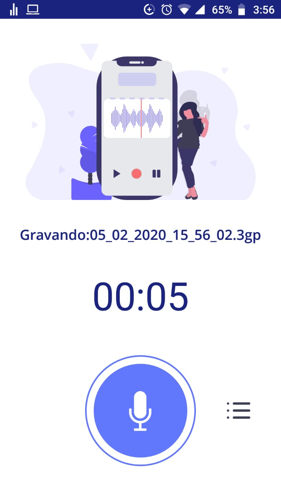
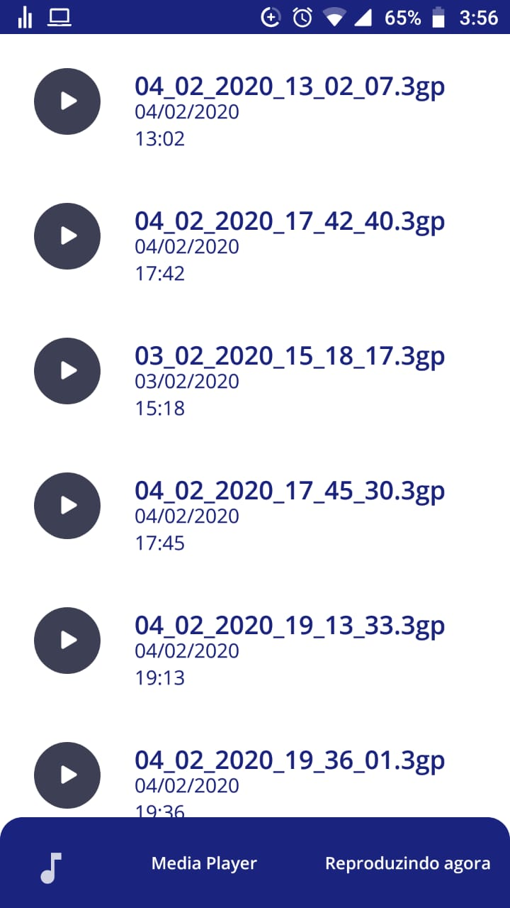
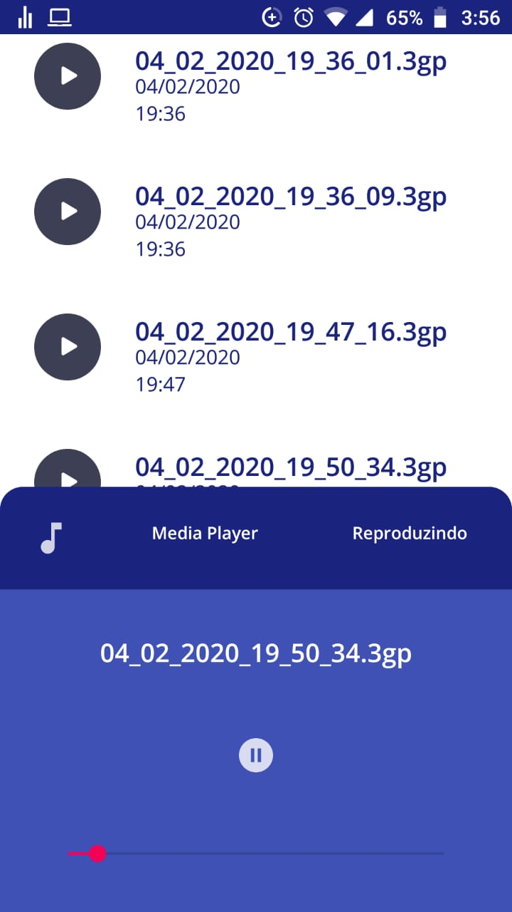

# SimpleRecorder

 

 

This app is made as a native Android project using Java!

This is the source code for a simple audio recording app with an integrated player with seekbar to move back or foward in the audio playig screeen.
Here you'll see an example of Material Navigation and Material Design Components usages.

If you have any doubts or suggestion contact me on Telegram: https://t.me/AndroidDev_Adriano.
Feel free to use the code and even send me any improvements so that I can update this project.

__________________________________________________________________________________________________________________________________________

Este aplicativo é feito como um projeto Android nativo utilizando Java!

Este é o código fonte de um aplicativo simples de gravação de áudio com um player integrado com barra de busca/progresso para retroceder ou avançar na tela de reprodução de áudio.

Aqui você verá um exemplo dos usos de Material Navigation e Material Design Components.

Se você tiver alguma dúvida ou sugestão, entre em contato comigo no Telegram: https://t.me/AndroidDev_Adriano.
Sinta-se à vontade para usar o código e até me enviar quaisquer melhorias para que eu possa atualizar este projeto.
